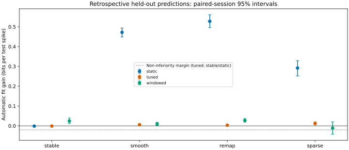
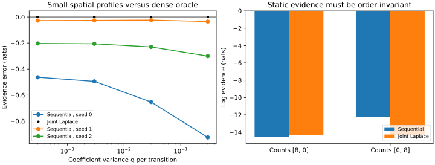
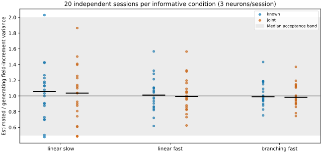

# Automatic graph drift-scale validation

The protocol was frozen after pilot seeds 0/1 and before independent final seeds
100--119. The [plan](../../plans/2026-07-16-drifting-graph-gp-place-field.md#execution-decisions-and-frozen-protocol-2026-10-08)
records settings, thresholds, and the pilot refinement from coefficient q to mean
field-increment variance when spatial shape is also fitted.

Run from the repository root, with the pinned spatial/test extras, x64 enabled
by each script, and without substituting an editable neurospatial checkout:

```bash
uv run --no-sync python notebooks/graph_place_field_joint_reference.py
uv run --no-sync python notebooks/graph_place_field_estimation_validation.py \
    --section optimizer --inference joint \
    --output-dir docs/validation/graph-place-field-estimation
uv run --no-sync python notebooks/graph_place_field_learning_validation.py \
    --section matched --output-dir docs/validation/graph-place-field-learning
uv run --no-sync python notebooks/graph_place_field_learning_validation.py \
    --section application --output-dir docs/validation/graph-place-field-learning
```

`joint_reference.json` compares fifteen small spatial q-profile points against
an independently constructed dense whitened Gaussian prior, Poisson posterior,
Hessian, covariance and normalized Laplace evidence. Joint evidence agrees to
6.2e-9 nats and modes to 1.5e-8 posterior SD. Converged sequential local updates
have errors up to 0.925 nats. A static rare-count counterexample changes sequential
evidence by 2.36 nats when count order reverses; joint evidence is invariant.
These results verify the approximation implemented, not exact posterior accuracy.
Existing scalar Bayes-integral artifacts retain the independent exact-posterior
comparison and its approximation limits.

`../graph-place-field-estimation/optimizer_joint.json` contains the twenty original
scalar datasets, three starts, and independent zero/positive reference searches
with expanded ranges and meshes. Profile-initialized L-BFGS meets the 0.001-nat
gate in **60/60 fits**, with maximum gap 5.7e-14 and projected-gradient convergence
in every fit. Plain L-BFGS also passes here (maximum gap 2.3e-6). The joint-objective Adam comparison (`../graph-place-field-estimation/sgd_joint.json`)
uses the same starts and expanded zero/positive profile. Adam reaches the 0.001-nat
gate in 10/60 fits at 200 steps and 36/60 at 1000 steps (worst gaps 5.57 and
0.148 nats). It remains an experimental alternative. The sequential optimizer
report and historical Adam report remain separate, with their inference settings
recorded. This scalar result does not prove joint spatial identification.

`matched.json` reports known-nuisance and jointly learned fits on three informative
positive conditions, static controls, and sparse/short controls; each has twenty
independent sessions and three neurons. Every retained mode, including baselines,
follows the stated prior/random walk. The recovery gate applies to the median
session mean ratio of estimated/generating field-increment variance (0.5--2),
with raw coefficient ratios reported too. Zero fractions, profile support,
parameter-bound hits, gradient convergence, field RMSE and coverage are retained.
Coverage concerns pointwise 90% Gaussian intervals conditional on fitted
hyperparameters; it excludes hyperparameter uncertainty. Bootstrap intervals
resample sessions, not time rows or neurons.

`application.json` reports independent analytic static/smooth/remapping/sparse
sessions. Training/validation/test use one-second blocks on the full grid. Automatic
fits use training counts only; fixed q and occupancy-map widths use validation
selection only. The task is retrospective interpolation across missing blocks,
not future forecasting. Test gains use Poisson-lognormal marginal predictions,
with session-paired 95% bootstrap intervals in bits per test spike. Fixed and
automatic graph fits have the same rank and nuisance-parameter policy. The tuned
fixed-q margin is -0.02 bits/spike in every condition; static controls use that
margin versus static, and the three moving conditions require a positive lower
bound versus static. Occupancy-map superiority is not a gate.

Runtime includes compilation and descriptive fitting wall time. Concurrent
validation processes share a machine, so their times do not establish a hardware
speedup or an isolated fit-only cost comparison. Biological recordings, arbitrary
geometries/ranks, exact Bayesian calibration, and causal prediction remain open.

## Fresh held-out prediction results (2026-10-08)

All four declared conditions pass both predictive gates, with **80/80 automatic
fits gradient-converged**. Values are mean bits/test-spike gains with paired
session 95% bootstrap intervals. Stable fits incur a small loss versus static
inference, well within the predeclared -0.02 margin.

| Condition | Automatic versus static | Versus validation-tuned fixed q | Versus windowed map |
| --- | --- | --- | --- |
| stable | -0.0014 [-0.0028, -0.0003] | -0.0012 [-0.0026, -0.0002] | +0.0242 [+0.0120, +0.0397] |
| smooth | +0.4719 [+0.4490, +0.4943] | +0.0055 [+0.0013, +0.0099] | +0.0097 [+0.0015, +0.0177] |
| remap | +0.5277 [+0.4957, +0.5607] | +0.0031 [+0.0006, +0.0068] | +0.0270 [+0.0182, +0.0370] |
| sparse | +0.2918 [+0.2520, +0.3290] | +0.0121 [+0.0051, +0.0200] | -0.0115 [-0.0429, +0.0204] |

Automatic pointwise 95% log-rate coverage averages 92.6% (stable), 97.4%
(smooth), 92.5% (remapping), and 92.5% (sparse). These intervals condition on
fitted hyperparameters and do not establish exact Bayesian calibration.
The sparse windowed-map comparison is inconclusive; its interval spans zero.
Other conditions favor the automatic graph fit over that baseline.





Generate these standalone figures and `summary.json` with:

```bash
uv run --no-sync python notebooks/graph_place_field_learning_report.py
```

## Fresh matched recovery results (2026-10-08)

All six informative known/joint conditions pass the median-ratio gate, and
**200/200 matched fits converge**. Ratios below are medians of session means
across three neurons. The interval is a session-bootstrap interval for the mean
field-variance ratio, not an interval for the median or an individual neuron.

| Condition | Known-shape median | Joint field-variance median | Joint coefficient-q median | Joint mean-ratio 95% interval | Joint 90% coverage |
| --- | --- | --- | --- | --- | --- |
| linear_slow | 1.056 | 1.037 | 1.803 | [0.876, 1.186] | 87.4% |
| linear_fast | 1.012 | 0.992 | 1.204 | [0.917, 1.110] | 88.9% |
| branching_fast | 0.991 | 0.982 | 1.268 | [0.942, 1.070] | 89.5% |

Joint coefficient medians also meet the original 0.5--2 ratio target in
all informative conditions. That does not establish separate identification of
q and kappa2: the full records retain their tradeoffs and error distributions.
Joint field RMSE is 0.154 (slow), 0.219 (fast), and 0.310 (branching), close to
the corresponding known-nuisance errors.

On static controls, 63.3% of joint neuron fits choose exact zero. Positive
estimates in the other 36.7% give a population mean field-increment variance
of 5.0e-6 per transition; a positive point estimate alone is not a drift test.
Spatial shape reaches a numerical bound in 14/20 static sessions.

The sparse/short condition was predeclared as uninformative, without a recovery
gate. Its joint field-variance median ratio is 0.869, but its raw-q median ratio
is 5612, shape/amplitude bounds occur in 15/20 sessions, and nominal 90% field
coverage is only **76.1%** (84.5% with known nuisance parameters). This is a
material limit: field amplitude, raw scale and spatial shape should not be treated
as jointly identified, and conditional uncertainty intervals are unreliable there.

The running study loaded an early bound diagnostic that counted masked q=0
optimizer placeholders as positive-bound hits. The stored diagnostic labels were
corrected from the fitted physical scales, matching the current source behavior;
fit parameters, likelihoods, convergence and gates were not altered.


